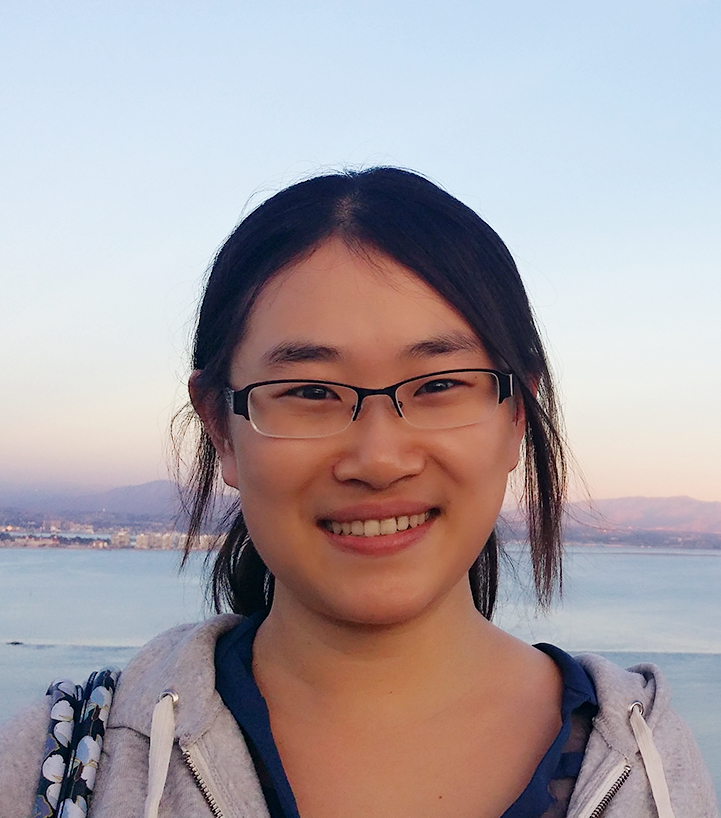

# Shuang Song

Email: shs037 at eng dot ucsd dot edu

## About me

I got my PhD from [UC San Diego](http://www.cs.ucsd.edu/) in Machine Learning and Differential Privacy under the supervision of [Prof. Kamalika Chaudhuri](http://cseweb.ucsd.edu/~kamalika/). Before joining UCSD, I obtained my BSc degree in Mathematics and Computer Science from [The Hong Kong University of Science and Technology](http://www.ust.hk).

I work at [Google Brain](https://research.google/teams/brain/).

## Publications

* Encode, Shuffle, Analyze Privacy Revisited: Formalizations and Empirical Evaluation [[pdf]](https://arxiv.org/abs/2001.03618)
Úlfar Erlingsson, Vitaly Feldman, Ilya Mironov, Ananth Raghunathan, **Shuang Song**, Kunal Talwar, and Abhradeep Thakurta

* Combining MixMatch and Active Learning for Better Accuracy with Fewer Labels [[pdf]](https://arxiv.org/abs/1912.00594) [[code]](https://github.com/google-research/mma)
**Shuang Song**, David Berthelot, and Afshin Rostamizadeh

* That which we call private [[pdf]](https://arxiv.org/abs/1908.03566)
Úlfar Erlingsson, Ilya Mironov, Ananth Raghunathan, and **Shuang Song**

* Scalable Private Learning with PATE [[pdf]](https://arxiv.org/abs/1802.08908)
Nicolas Papernot, **Shuang Song**, Ilya Mironov, Ananth Raghunathan, Kunal Talwar, and Úlfar Erlingsson
International Conference on Learning Representations (ICLR), 2018

* Rényi Differential Privacy Mechanisms for Posterior Sampling [[pdf]](https://arxiv.org/abs/1710.00892)
Joseph Geumlek, **Shuang Song**, and Kamalika Chaudhuri
Neural Information Processing Systems (NIPS), 2017

* Composition Properties of Inferential Privacy for Time-Series Data [[pdf]](https://arxiv.org/abs/1707.02702)
**Shuang Song**, and Kamalika Chaudhuri
Allerton Conference on Communication, Control and Computing, 2017

* Pufferfish Privacy Mechanisms for Correlated Data [[pdf]](https://arxiv.org/abs/1603.03977)
**Shuang Song**, Yizhen Wang, and Kamalika Chaudhuri
ACM SIGMOD International Conference on Management of Data (SIGMOD), 2017

* Learning from Data with Heterogenous Noise using SGD [[pdf]](http://arxiv.org/abs/1412.5617)
**Shuang Song**, Kamalika Chaudhuri, and Anand D. Sarwate
International Conference on Artificial Intelligence and Statistics (AISTATS) 2015

* The Large Margin Mechanism for Differentially Private Maximization [[pdf]](http://arxiv.org/abs/1409.2177)
Kamalika Chaudhuri, Daniel Hsu, and **Shuang Song**
Neural Information Processing Systems (NIPS) 2014

* Stochastic Gradient Descent with Differentially Private Updates [[pdf]](http://cseweb.ucsd.edu/~kamalika/pubs/scs13.pdf)
**Shuang Song**, Kamalika Chaudhuri, and Anand Sarwate
GlobalSIP Conference, 2013

## Teaching
* Teaching Assistant of CSE 151: Introduction to AI: A Statistical Approach, Winter 2017, Winter 2016, Spring 2014
* Teaching Assistant of CSE 250C: Machine Learning Theory, Spring 2016
